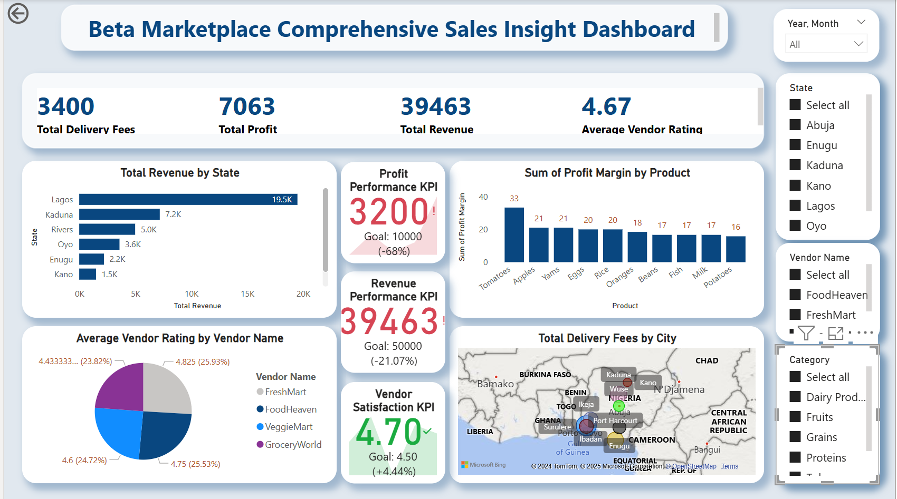

## ABOUT ME
Hello! I’m Godwin Amurawaiye 🤓—a data analyst and educator with a knack for turning raw data into powerful insights that drive strategic decisions and fuel business success. With a proven track record in the telecommunication and sales industries, I specialize in analyzing complex datasets to optimize operations, enhance customer experiences, and unlock revenue growth opportunities. My passion lies in uncovering patterns, solving problems, and helping organizations make data-driven decisions that truly make an impact. Let’s explore the endless possibilities hidden in the numbers!

## SKILLS
*As a Data Analyst at Foodtraco Nigeria, I deliver consulting and training solutions to help Foodtraco leverage data effectively while mentoring aspiring analysts to kickstart their careers.*

 **- ✅ Data Analytics Consulting.**      

I deliver detailed analyses and customized solutions to empower data-driven decision-making, streamline processes, and fuel business growth.

**- ✅ Staff Training & Development.**

I provide comprehensive training programs in data analysis, visualization, and data-driven decision-making, tailored for all skill levels—from beginner to advanced.

## MY PROJECTS
*A glimpse of some of the projects I've been working on.*

**Beta Marketplace Comprehensive Sales Insight and Recommendations.**

This document provides an overview of key insights and performance metrics derived from the Beta Marketplace Comprehensive Sales Insight and Recommendations.

[Read More](https://medium.com/@godwinamurawaiye/beta-marketplace-comprehensive-sales-insights-and-recommendations-3916c1e69e18)

<a href="17 How to Present Data to Executives by Anietie Etuk.pdf">Download the Report here (pdf file)</a>

## CONTACT DETAILS

*Let’s connect and see how we can make a difference together!*
<table>
  <tbody>
    <tr>
      <td>📧</td>
      <td><a href="mailto:godwinamurawaiye@gmail.com">godwinamurawaiye@gmail.com</a></td>
    </tr>
    <tr>
      <td>📞</td>
      <td>(234) 916-176-4422</td>
    </tr>
    <tr>
      <td>📍</td>
      <td>Kaduna, Nigeria</td>
    </tr>
    <tr>
      <td>⬇️</td>
      <td><a href="https://etuk123456.github.io/portfolio1/docs/Profile.pdf">Download my CV</a></td>
    </tr>
    <tr>
      <td>🌐</td>
      <td><a href="[https://www.linkedin.com/in/amurawaiye-godwin">The things I do daily on LinkedIn</a></td>
    </tr>
    <tr>
      <td>📺</td>
      <td><a href="coming soon">Watch my tutorials on YouTube</a></td>
    </tr>
  </tbody>
</table>
